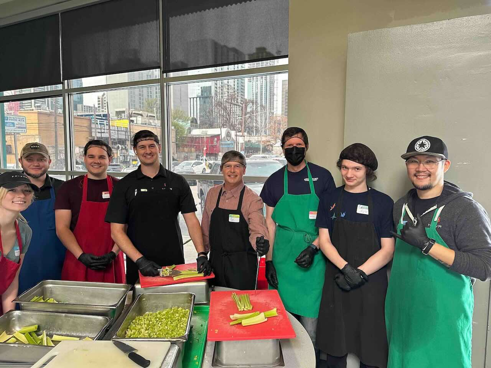
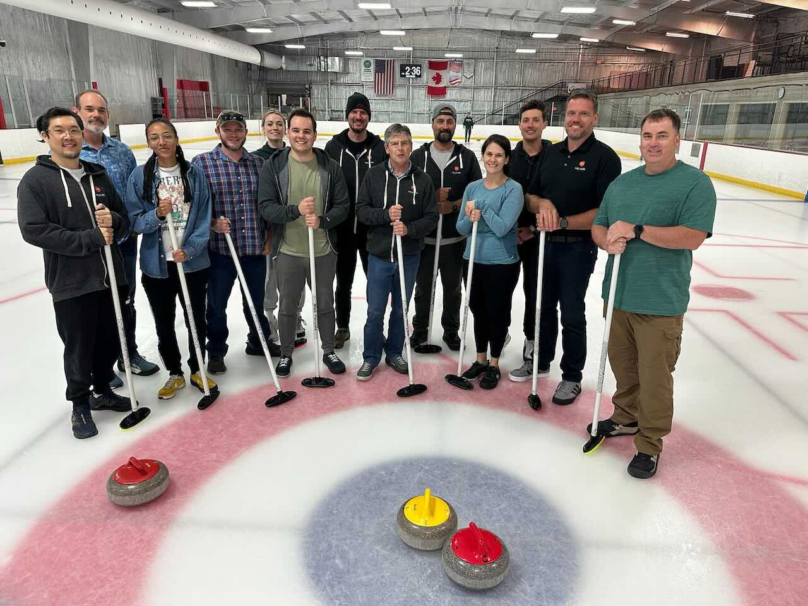
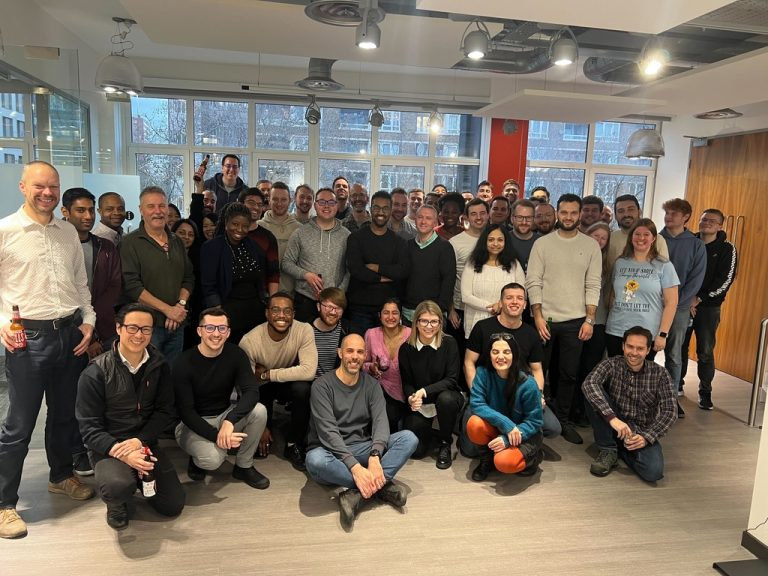
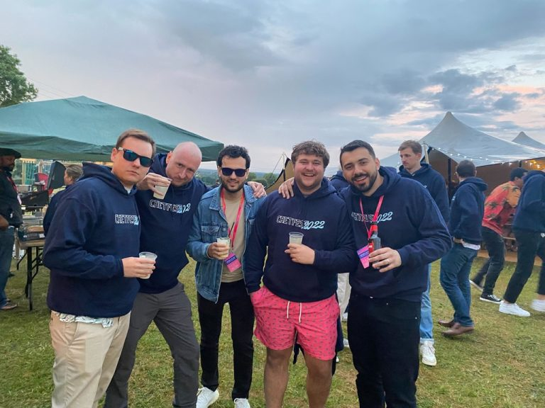
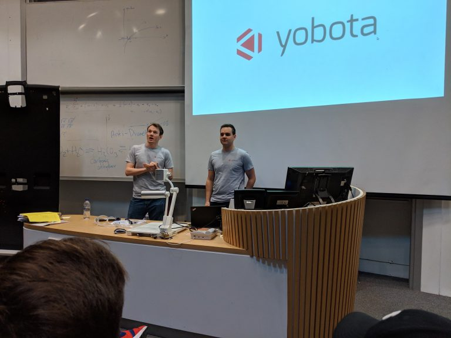
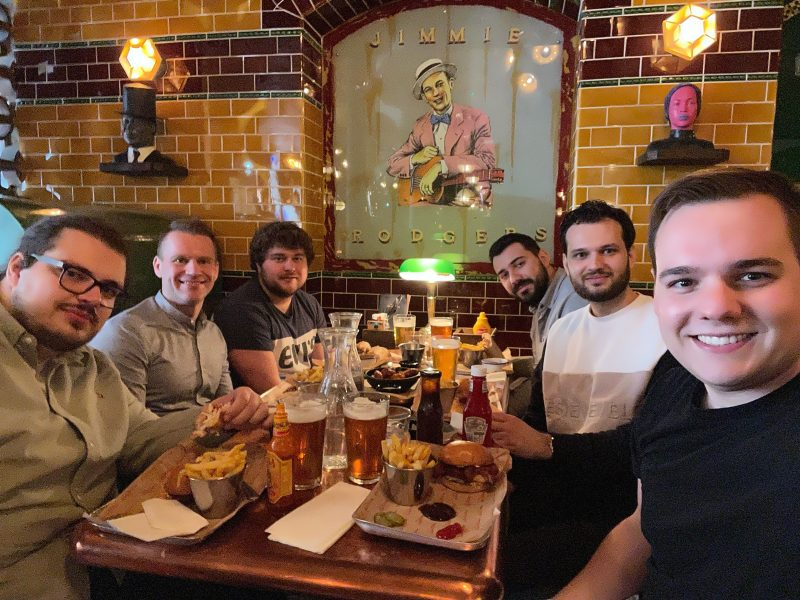
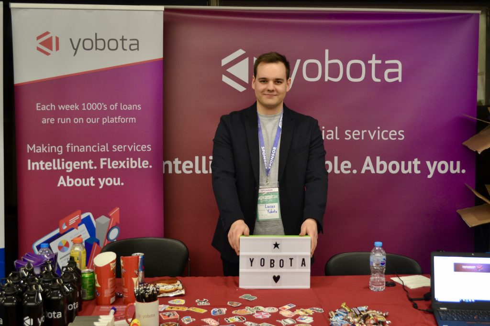
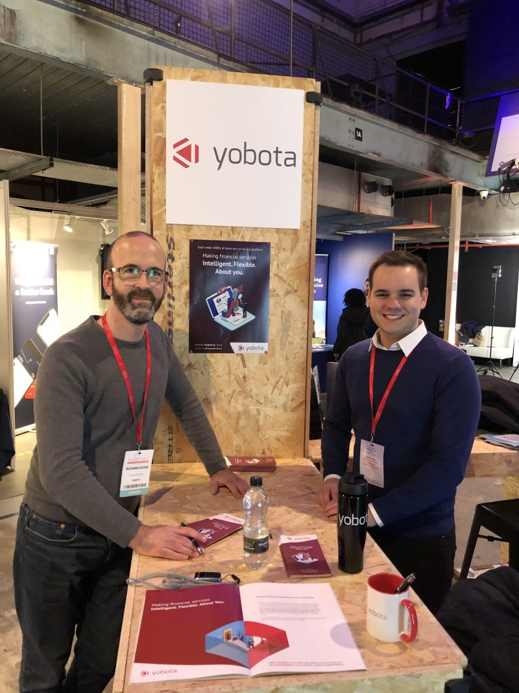
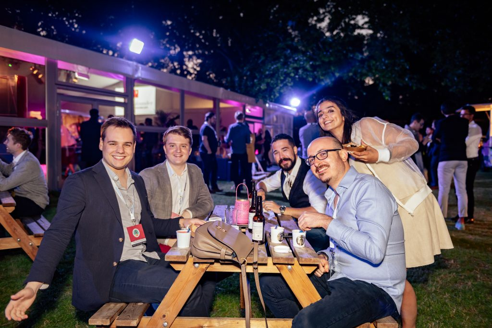

## Senior Software Engineer @ [HUVR](https://huvrdata.com): 2023-present

At HUVR, we believe that the industrial asset inspection paradigm is broken.
We deliver a simple to use, purpose-built platform that transforms the way data is collected, managed, and monetized.

  
  
HUVR preparing meals in a soup kitchen in 2024

  
  
HUVR doing some curling in 2025

## Engineering Team Lead @ [Chetwood Financial](https://www.chetwood.co): 2022-2023

In 2022 I was promoted to be the Engineering Team Lead for my team, taking on 4 direct reports. The company (Yobota) was later acquired by the bank Chetwood Financial, our biggest client. During the organisation changes, I was offered to take on an additional team as my responsibility: the Quantitive and Simulations team - growing my direct reports to 10 engineers. This increased my leadership responsibilities and meant I spent more time guiding the developers and being involved in higher-lever discussions with the executive management.

During this time I was focused on stabilising and improving the team habits by documenting and improving the development process; mentoring team members to help them grow and achieve their goals; and distributing company information and organising social events.

Even with my increased managerial responsibilities, I maintained some time for technical work. Some examples of tasks I worked on include: designed and implemented a new integration with a new online card payment provider (Worldpay by FIS) in our banking platform; helped design a new type of Deposit Account product in our platform; created multiple GitHub Actions to help improve development process including a Django database migration validator and automated regression test runner.

  
  
The Chetwood engineering team in London

  
  
Chetwood's annual summer party 'Chetfest' in 2022

#### Technologies and skills used

Software Engineering · Python · Team Leadership · Software Architecture · Project Management · Amazon Web Services (AWS) · management

## Software Developer @ [Yobota](https://yobota.com): 2018-2022

I joined the company as the 20th employee, into a small team of 2 people. Our team was responsible for handling all communications from our internal banking system to external third parties such as Banks, Credit Bureaus, Payment Providers, CRMs, and more. We developed and maintained an API that performed a number of tasks such as inbound and outbound payments, direct debits, credit checks, customer communications, etc.

  
  
Working from the office in London

I was tasked with developing new features, performing maintenance on the system, helping investigations during production incidents, assessment and interviewing of new candidates. As the company was quite small, the scope of my role changed often and I took on lots of different tasks and adapted to changes in the organisation around priorities and restructures.

Some examples of projects I worked on include following: I designed and developed a testing framework used internally and by our QA team to ‘fake’ responses from our third parties; added Prometheus metrics to our API and built a Grafana dashboard to view the system health/stats; implemented an auto-scaling process for our hosted servers based on a Redis datastore to improve cost efficiency; integrated with AWS Secrets Manager to more securely handle third-party credentials; designed and implemented new Django REST endpoints for new features and a framework for segregation of accounts using a Postgres Database cache.

  
  
Presenting our company during the Sussex hackathon in 2018

  
  
One of many lunches with the team

Three years into my role I was promoted to the Senior position to recognise the value I brought to the business. I was viewed by the company as the main point of contact for all work regarding connectivity to third-party integrations.

This increased responsibility meant that I spent a lot of time on high importance projects and was trusted to deliver highly functional and scalable solutions. My internal role title was “Solution Architect” as I was responsible for planning and designing new asks from our clients and internal stakeholders, and communicating with the Account Managers of our partners. I was also trained and trusted to recruit new talent for our and other teams, including reviewing CV’s, interviewing candidates, and reviewing technical exercises.

Some examples of projects I worked on include: integrated the Yobota Banking Platform with the Salesforce CRM API to store customer records; successfully implemented and launched Direct Debits for business bank accounts for a new client; designed, presented internally, and implemented a large effort to make our systems more generic and flexible, with better separation of concerns; performed multiple presentations to technical and non-technical audiences about technical topics; wrote automated regression tests in BDD and Cypress (Javascript framework).

  
  
Imperial College London's annual Hackathon

  
  
Our stand at the Fintech Talents conference

  
  
The European Tech Startup Awards, Yobota nominated for Hottest Fintech Startup

#### Technologies and skills used

Software Engineering · Python · Project Management · Shell Scripting · Test Driven Development · PostgreSQL · Redis · Django REST Framework · Docker · Amazon Web Services (AWS) · Management · Agile Methodologies · GitHub
