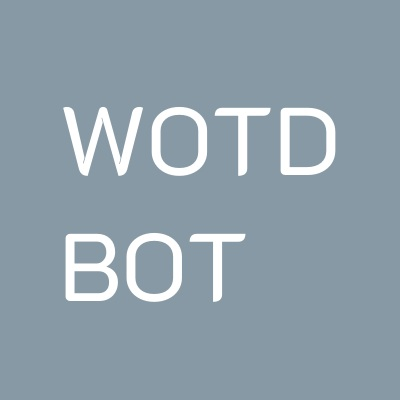
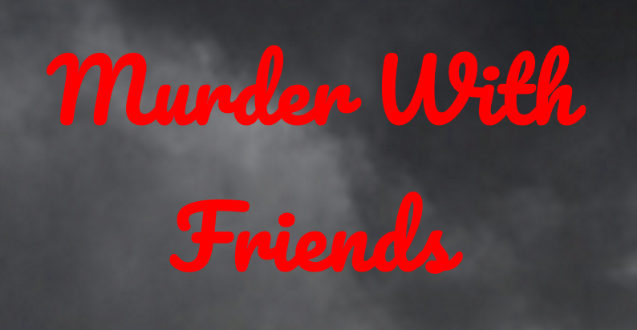

<!-- Template:

    .jpg" class="project-image">
    

        <h3>
            <a href="/portfolio/<>">Title</a> — Date
        </h3>
        

            Description
        

    

-->

 

    
    

        <h3>
            <a href="/portfolio/word-of-the-day-bot">Word of the Day Bot</a> — December 2020
        </h3>
        

            I created an app that posts a new word or phrase and its definition every day in a picture on social media.
            I documented the journey from the start of the idea to the fully working project. <a href="/portfolio/word-of-the-day-bot">Read more...</a>
        

    

    
    

        <h3>
            <a href="../2018/01/01/murder-with-friends.html">Murder With Friends – Global Game Jam 2018</a> — January 2018
        </h3>
        

            For the Global Game Jam of 2018, our 5-man team created a multiplayer game where friends have to defeat their friends by spawning monsters and activating traps in a creepy dungeon. The main player controls a gun-wielding character from a computer, whilst the others control the environment through their phones, enabling multiplayer on a single computer.  <a href="../2018/01/01/murder-with-friends.html">Read more...</a>
              
            Unity, C#, Web Apps, Web Server, Game Design, Animation, Artwork, Teamwork
        

    

    
    

        <h3>
            <a href="/2017/12/03/fight-twitter.html">Fight Twitter Hackathon</a> — December 2017
        </h3>
        

            In this hackathon, we combined Twitter and silly physics to create Fight Twitter – a slapstick fighting game where the fighters look like real twitter users. Just enter two Twitter usernames, and slap each other off the platforms to win. This was designed and implemented in 12 hours. <a href="/2017/12/03/fight-twitter.html">Read more...</a>
              
            Unity, C#, Twitter scripts, Game Design, Animation, Game Music, Teamwork
        

    

    
    

        <h3>
            <a href="/2017/11/01/starlight-hackathon.html">Rolls-Royce Starlight hackathon for HackSussex</a> — November 2017
        </h3>
        

            After another very successful Hackathon at the University of Sussex, I review our experiences and the lessons learned from this
            24-hour challenge. We took on the Rolls-Royce Starlight challenge, successfully constructing a hardware and software prototype,
            and being awarded with the competition’s Hardware Challenge prize and Major League Hacking finalist medal. 
            <a href="/2017/11/01/starlight-hackathon.html">Read more...</a>
              
            Arduino, C++, LED, Hardware, Electrical Engineering, Teamwork
        

    

    
    

        <h3>
            <a href="/2017/08/01/sleep-wake.html">Environment-modelling robots with sleep-wake cycles</a> — May-Aug 2017
        </h3>
        

            Intelligent Systems MSc Thesis at Sussex University
            This project consists of applying machine learning to a robotic vehicle to make it create a model of its environment through its
            sensory information, allowing the autonomous completion of a goal. The robot will go through “sleep-wake” cycles to accelerate
            the process of problem solving, by doing “offline” processing with data gathered in real-time by the wake cycle.
            <a href="/2017/08/01/sleep-wake.html">Read more...</a>
              
            Python, Neural Networks, Robotics, Adaptive Behaviour, NARX networks, Simulations
        

    

    
    

        <h3>
            <a href="/portfolio/power-is-everything">Power is Everything Hackathon</a> — July 2017
        </h3>
        

            Power is Everything is a game that achieved 10th place for the Game Maker’s Toolkit 2017 Game Jam where teams have 48 hours to
            produce a working game.
              
            Our 4-man team created a side Scrolling shoot-me-up with one core concept: your power bar limits your progression through the game. <a href="/portfolio/power-is-everything">Read more...</a>
              
            C++, Game Design, Artwork, Game Music, Teamwork
        

    

    
    

        <h3>
            <a href="/portfolio/worldstoriesvr">WorldStoriesVR: VR history lessons</a> — Apr-May 2017
        </h3>
        

            World Stories VR is an immersive storytelling VR app where users can learn different topics of history, be it historical figures
            and their stories or countries and their past. The smartphone app, when paired with a VR headset, provides high-quality documentary-style lessons on a chosen topic to be enjoyed in the comfort of your own home.
            <a href="/portfolio/worldstoriesvr">Read more...</a>
              
            C#, Unity, Virtual Reality, Technology Enhanced Learning Environments
        

    

    
    

        <h3>
            <a href="/portfolio/heatmapp">HeatmAPP: Property value heatmap</a> — Oct-Dec 2016
        </h3>
        

            A UK property price heatmap application. Users can search any city by postcode or use their current location to view pricing
            information. House prices in the area are displayed on a scale of green (cheaper) to red (expensive). The app uses a big database
            on Amazon EC2 Servers and was programmed in Android Studio in Java.
            <a href="/portfolio/heatmapp">Read more...</a>
              
            Java, Android, Big Data, PHP, Software Engineering, SQL, Agile
        

    

    
    

        <h3>
            <a href="/portfolio/clever-checkers">CleverCheckers: Checkers game with AI opponents</a> — Oct-Dec 2016
        </h3>
        

            A checkers game with AI opponents of varying difficulty. The application has a beautiful, easy to use interface with hints to
            help you make the right decisions. Choose from 5 different difficulty levels or play agains another human. The application was
            programmed in Java using Swing and AWT.
            <a href="/portfolio/clever-checkers">Read more...</a>
              
            Java, AI, Game Design, GUI, Decision Trees
        

    

    
    

        <h3>
            <a href="/portfolio/SWhile">SWhile: Simple IDE for WHILE</a> — 2015-2016
        </h3>
        

            An application for programmers to write and execute programs in the WHILE language. The project consisted of making an
            interpreter for the language in Java with an interface in Scala.
            Once developed, this was used by students in the Limits of Computation course taught by Bernhard Reus at the University of Sussex.
            <a href="/portfolio/SWhile">Read more...</a>
              
            Scala, Java, JavaCC, Compilers, Software Engineering
        

    

    
    

        <h3>
            <a href="/portfolio/pdftolist">PdfToList: CERN Civil Engineering Plan information extraction</a> — July 2015
        </h3>
        

            Information extraction tool for civil engineering plans. Developed for the Civil Engineering department of CERN during my
            internship in 2015. The program extracts relevant information into an excel document.
            <a href="/portfolio/pdftolist">Read more...</a>
              
            Python, Software Engineering, Data Science
        

    

